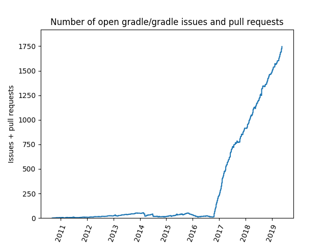

# ghcfd
Script to auto-generate a cumulative flow diagram (number of open issues over time) for any GitHub repository.

The issues CFD will generate a local dump the first time as 'issues_dump'. This helps in speeding up generation of the plot in subsequent script runs. However, you would need to delete the issues_dump file to get the latest status on your project.

Example:

